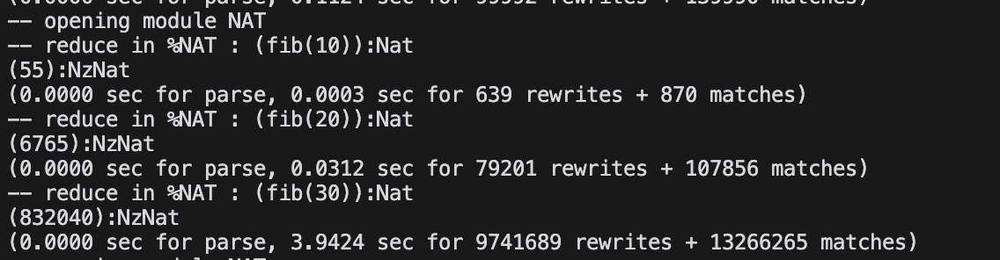

# Functional Programming : Homework 1

提出者：佐藤直人(s2435026) 科目履修生

## - Exercise1

```cafeobj
-- (1)factorial function
open NAT .
    op fact : Nat -> Nat .
    var NzX : NzNat .
    eq fact(0) = 1 .
    eq fact(NzX) = NzX * fact(p NzX) .
    --
    red  fact(0) .
    red  fact(1) .
    red  fact(10) .
    red  fact(100) .
    red  fact(1000) .
    -- red  fact(10000) .
close

-- (2) Odd Even factorial function

open NAT .
    op cond : Bool Nat Nat -> Nat .
    op g : Nat Nat -> Nat .
    op oedc-fact : Nat -> Nat .
    vars X Y : Nat .
    var NzX : NzNat .
    -- cond
    eq cond(true, X, Y) = X .
    eq cond(false, X, Y) = Y .
    -- g
    eq g(X,Y) = cond(X > Y, g(X, 2 * Y) * g(sd(X,Y), 2 * Y), X) .
    -- oedc-fact
    eq oedc-fact(0) = 1 .
    eq oedc-fact(NzX) = g(NzX,1) .
    -- compute
    red oedc-fact(0) .
    red oedc-fact(1) .
    red oedc-fact(10) .
    red oedc-fact(100) .
    red oedc-fact(1000) .
    red oedc-fact(10000) .
close

-- (3) fibonacci function
open NAT .
    op fib : Nat -> Nat .
    op sfib : Nat -> Nat .
    var NzX : NzNat .
    -- fib
    eq fib(0) = 0 .
    eq fib(NzX) = sfib(p NzX) .
    -- sfib
    eq sfib(0) = 1 .
    eq sfib(NzX) = fib(NzX) + fib(p NzX) .
    -- compute
    red fib(10) .
    red fib(20) .
    red fib(30) .
close

-- (4) Ackermann function

open NAT .
    op ack : Nat Nat -> Nat .
    var Y : Nat .
    vars NzX NzY : NzNat .
    eq ack(0,Y) = Y + 1 .
    eq ack(NzX, 0) = ack(p NzX, 1) .
    eq ack(NzX, NzY) = ack(p NzX, ack(NzX, p NzY)) .
    --
    red ack(0, 0) .
    red ack(1, 1) .
    red ack(2, 2) .
    red ack(3, 2) .
    red ack(3, 3) .
close
```

### Result

1. factorial function
   

2. Odd Even factorial function
   

3. fibonacci function
   

4. Ackermann function
   

## - Exercise2

### Explain in which way fact(5) is computed

- fact(5)

```cafeobj

fact(5) = 5 * fact(p 5)
        = 5 * fact(4)
        = 5 * 4 * fact(p 4)
        = 5 * 4 * fact(3)
        = 5 * 4 * 3 * fact(p 3)
        = 5 * 4 * 3 * fact(2)
        = 5 * 4 * 3 * 2 * fact(p 2)
        = 5 * 4 * 3 * 2 * fact(1)
        = 5 * 4 * 3 * 2 * 1 * fact(p 1)
        = 5 * 4 * 3 * 2 * 1 * fact(0)
        = 5 * 4 * 3 * 2 * 1 * 1
        = 120
```

## Exercise3

### Explain in which way oedc‐fact(5) is computed

- oedc-fact(5)

- code

```cafeobj

open NAT .
    op cond : Bool Nat Nat -> Nat .
    op g : Nat Nat -> Nat .
    op oedc-fact : Nat -> Nat .
    vars X Y : Nat . var NzX : NzNat .
    -- cond
    eq cond(true, X, Y) = X .
    eq cond(false, X, Y) = Y .
    -- g
    eq g(X,Y) = cond(X > Y, g(X, 2 * Y, Y) * g(sd(X,Y), 2 * Y), X) .
    -- oedc-fact
    eq oedc-fact(0) = 1 .
    eq oedc-fact(NzX) = g(NzX, 1) .
    -- compute
    red oedc-fact(1000) .
close

```

- execution of oedc-fact(5)

```text

oedc-fact(5)
    = g(5, 1)
    = cond(5 > 1, g(5, 2 * 1) * g(sd(5, 1), 2 * 1), 5)
    = cond(true, g(5, 2 * 1) * g(sd(5, 1), 2 * 1), 5)
    = g(5, 2) * g(sd(5, 1), 2)
    = g(5, 2) * g(4, 2)
    = cond(5 > 2, g(5, 2 * 2) * g(sd(5, 2), 2 * 2), 5) * cond(4 > 2, g(4, 2 * 2) * g(sd(4, 2), 2 * 2), 4)
    = g(5, 4) * g(3, 4) * g(4, 4) * g(2, 4)
    = cond(5 > 4, g(5, 2 * 4) * g(sd(5, 4), 2 * 4), 5) *
      cond(3 > 4, g(3, 2 * 4) * g(sd(3, 4), 2 * 4), 3) *
      cond(4 > 4, g(4, 2 * 4) * g(sd(4, 4), 2 * 4), 4) *
      cond(2 > 4, g(2, 2 * 4) * g(sd(2, 4), 2 * 4), 2)
    = g(5, 8) * 3 * 4 * 2
    = 5 * 3 * 4 * 2
    = 120
```

- oedc-fact(5) = 120
- fact(5) = 120

同じ値が計算された。
